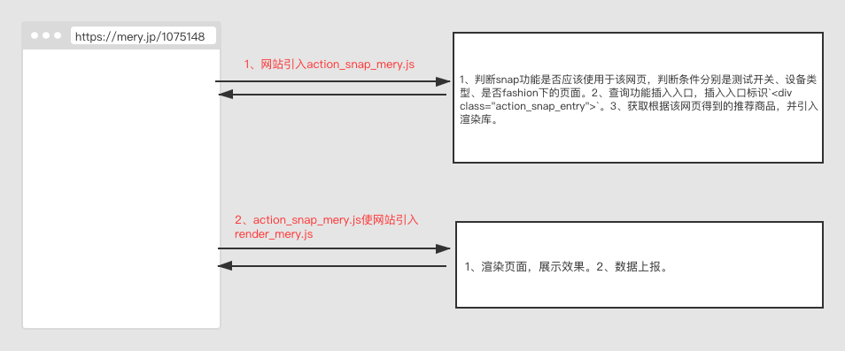

# 目录结构
```
|-- action_snap
    |-- .babelrc 
    |-- .gitignore 
    |-- package-lock.json
    |-- package.json
    |-- postcss.config.js
    |-- readme.md
    |-- webpack.config.js
    |-- dist
    |-- asset // 一些资源文件（与功能无关的）
    |-- media // 存放在discovery上的js
    |-- src 
        |-- index.js // 在这里切换选择媒体
        |-- commonComponent // 公共组件
        |-- costomized // 媒体定制化样式
        |-- media // 媒体配置、索引
        |-- normal // 常用样式
        |-- report // 数据上报相关
        |-- utils //工具类
        |-- asset //存放资源文件等
```
# action_snap工作原理说明（以mery为例）
1. mery站点会引入我们发布在discover上的js(dMery，为了方便说明，这是对js的简称)：<https://api.popin.cc/searchbox/action_snap_mery.js>
2. dMery的主要工作有三项：
    - 判断snap功能是否应该使用于该网页，判断条件分别是测试开关、设备类型、是否fashion下的页面。
    - 查询功能插入入口，插入入口标识`<div class="action_snap_entry"></div>`。
    - 获取根据该网页得到的推荐商品，并引入渲染库：<https://api.popin.cc/action_snap/render_mery.js>(rMery)。
3. rMery的主要工作有两项：
    - 渲染页面，展示效果。
    - 上报数据。


